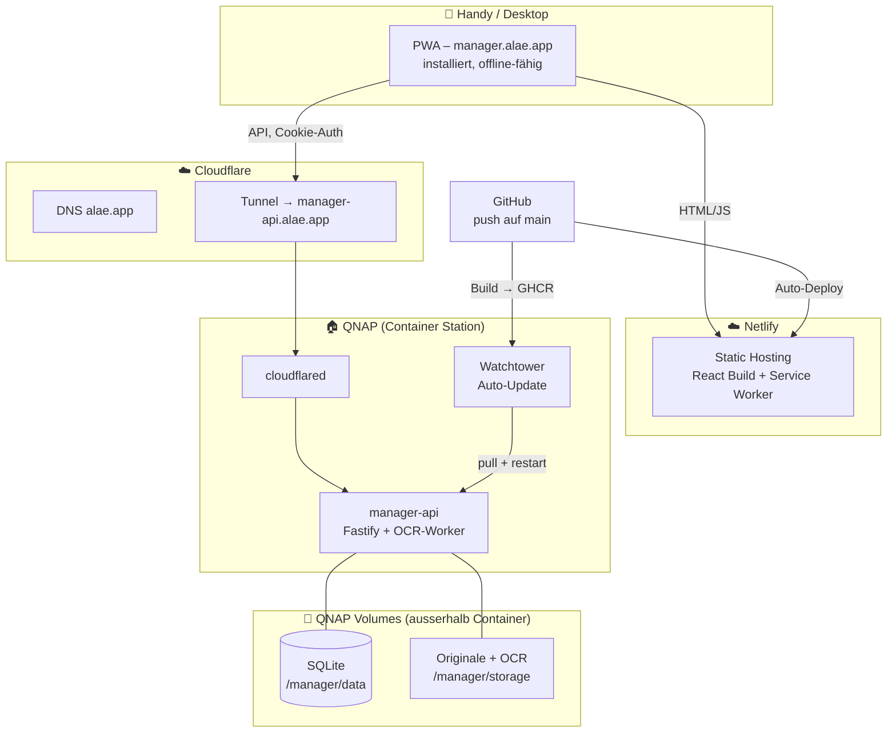
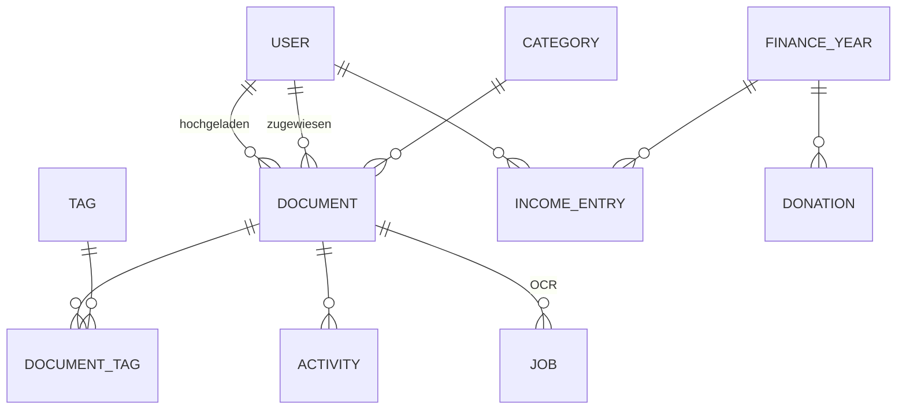
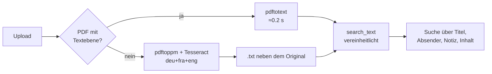
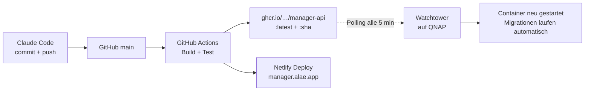

# Manager – Konzept

Haushalts-Administration als PWA. Dokumente, Pendenzen, Einkaufsliste, Notizen und
Finanzen (Zehnten / Fastopfer) für zwei Personen.

Stand: 2026-07-28 · Status: Entwurf zur Freigabe

---

## 1. Ziel und Rahmen

**Problem:** Rechnungen, Post, Verträge und Belege liegen verteilt in Mail-Postfächern,
auf Papier und in Screenshots. Niemand weiss zuverlässig, was noch offen ist.

**Ziel:** Eine App, die auf dem Handy in unter 10 Sekunden ein Dokument aufnimmt,
es durchsuchbar ablegt, klar zeigt wer was wann erledigt hat – und daneben die
täglichen Kleinigkeiten (Einkauf, Notizen) sowie die Zehnten-Abrechnung abdeckt.

**Leitprinzipien:**

1. **Mobile first, Daumen first.** Jede Kernaktion in maximal zwei Taps erreichbar.
2. **Die Daten gehören uns.** Originaldateien liegen als normale Dateien auf dem QNAP,
   in einer lesbaren Ordnerstruktur – auch dann noch nutzbar, wenn die App eines Tages
   nicht mehr läuft.
3. **Der Container ist wegwerfbar.** Alles Wertvolle liegt in gemounteten Volumes,
   nicht im Container. Neu deployen darf nie Daten kosten.
4. **Nichts erzwingen.** OCR, Kategorien und Metadaten sind Vorschläge, keine Pflichtfelder.

**Nicht im ersten Wurf:** Mehrere Haushalte, Rollen/Rechte über "beide sehen alles"
hinaus, Buchhaltung im engeren Sinn, E-Mail-Postfach-Anbindung, Kalender.

---

## 2. Architektur im Überblick



**Kurz:** Frontend statisch auf Netlify, Backend als Container zuhause auf dem QNAP,
verbunden über einen Cloudflare Tunnel. Daten liegen in zwei Bind-Mounts auf dem NAS.
Deployment passiert vollständig über `git push`.

---

## 3. Technologie-Entscheide

| Bereich | Wahl | Begründung |
|---|---|---|
| Frontend | React 19 + TypeScript + Vite | Schnell, riesiges Ökosystem, gute PWA-Tooling-Lage |
| UI | Tailwind CSS + Radix Primitives | Mobile-first ohne Design-System-Ballast, barrierefreie Basiskomponenten |
| PWA | `vite-plugin-pwa` (Workbox) | Manifest, Service Worker, Precaching, Share Target aus einer Hand |
| State/Sync | TanStack Query + IndexedDB (Dexie) | Server-State-Caching und Offline-Queue ohne eigenes Framework |
| Backend | Node 22 + Fastify + TypeScript | Eine Sprache über den ganzen Stack, sehr schneller Upload-Pfad (Streams) |
| Datenbank | SQLite (better-sqlite3, WAL) + Drizzle ORM | Für zwei Nutzer ideal: eine Datei, kein Server, trivial zu sichern |
| Volltextsuche | Vereinheitlichte Spalte `search_text` + `LIKE` | FTS5 war geplant, wurde aber nicht gebraucht: Bei zwei Personen und einigen tausend Dokumenten ist `LIKE` schnell genug, und die Vereinheitlichung (Umlaute ausgeschrieben, Akzente entfernt) löst das Problem, an dem FTS5 hier gescheitert wäre – `LIKE` in SQLite kennt nur ASCII-Gross-/Kleinschreibung, `PRÄMIE` fände `Prämie` sonst nicht |
| OCR | Tesseract (deu, fra, eng) | Solides C++-Werkzeug ohne Abhängigkeitskette. OCRmyPDF wurde verworfen: Es zöge Python und Ghostscript nach und blähte das Image um mehrere hundert Megabyte auf – spürbar bei jedem Update über die Hausleitung. Sein Mehrwert wäre ein durchsuchbares PDF; den Text liefert Tesseract genauso, und er landet als .txt neben dem Original |
| PDF-Tools | Poppler (`pdftotext`, `pdftoppm`) | Digital erzeugte PDFs brauchen gar kein OCR |
| Jobs | Job-Tabelle in SQLite + In-Process-Worker | Kein Redis, keine zweite Infrastruktur für ~20 Jobs/Tag |
| Auth | Passwort (argon2id) + HttpOnly-Session-Cookie | Zwei Konten, kein Identity-Provider nötig |

**Warum SQLite und nicht Postgres:** Zwei Nutzer, wenige Schreibzugriffe gleichzeitig.
SQLite bedeutet: ein Container statt zwei, Backup = Dateikopie, kein Verbindungs-Pooling,
keine Passwörter. Wichtig ist nur, dass die DB-Datei auf einem *lokalen* QNAP-Volume liegt
(nicht auf einer NFS/SMB-Freigabe) – das ist mit Container-Station-Bind-Mounts gegeben.
Sollte die App je wachsen, ist der Wechsel dank ORM-Schicht ein überschaubarer Umbau.

---

## 4. Datenablage auf dem QNAP

Zwei getrennte Bind-Mounts, beide ausserhalb des Containers:

```
/share/Container/manager/data/          → DB_DIR   (SQLite + WAL, klein, schnell)
/share/Dokumente/Manager/               → STORAGE_DIR (Originale + Ableitungen, gross)
```

`STORAGE_DIR` darf bewusst auf einer anderen Freigabe oder einem anderen Volume liegen –
dort, wo dein bestehendes Backup (Hybrid Backup Sync / Snapshots) ohnehin schon greift.

**Ordnerstruktur der Ablage – bewusst menschenlesbar:**

```
/share/Dokumente/Manager/
├── 2026/
│   ├── Rechnungen/
│   │   ├── 2026-03-14__Krankenkasse-Praemie-Maerz__a3f9.pdf
│   │   └── 2026-03-14__Krankenkasse-Praemie-Maerz__a3f9.txt   ← OCR-Text
│   ├── Steuererklaerung/
│   └── Unsortiert/                      ← alles frisch Hochgeladene
├── 2025/
├── .previews/                           ← gerasterte PDF-Seiten, jederzeit neu erzeugbar
└── .trash/                              ← 30 Tage Papierkorb, dann echt gelöscht
```

* Dateiname = `Datum__Titel__kurz-ID`. Die 4-stellige ID am Ende macht ihn eindeutig,
  auch wenn zwei Dokumente gleich heissen.
* Die Datenbank kennt nur den **relativen Pfad**. Wird der Storage-Ordner verschoben,
  ändert sich nur eine Umgebungsvariable.
* Bei Änderung von Titel/Kategorie/Datum benennt die App die Datei atomar um und
  schreibt den neuen Pfad in die DB – die Ablage bleibt dauerhaft aufgeräumt.
* Ableitungen (OCR-Text, durchsuchbares PDF, Thumbnail) liegen neben dem Original.
* **Deduplizierung:** SHA-256 jeder Datei wird gespeichert. Beim Upload eines Duplikats
  fragt die App nach, statt still ein zweites Exemplar anzulegen.

---

## 5. Datenmodell



**Kerntabellen**

* `users` – id, name, email, password_hash, avatar_color, created_at
* `documents` – id, title, storage_path, mime, size_bytes, sha256, **uploaded_by**,
  **uploaded_at**, doc_date, category_id, **assigned_to**, **status**, due_date,
  amount_chf, vendor, ocr_status, ocr_text, notes, deleted_at
* `categories` – id, name, icon, sort_order (Steuererklärung, Kinder, Rechnungen,
  Wichtige Dokumente, Sonstiges). „Unsortiert" steht bewusst nicht darin: Das ist das
  Fehlen einer Zuordnung und damit der Zustand jedes frisch hochgeladenen Dokuments –
  als eigene Zeile gäbe es zwei Arten, dasselbe zu sagen. Die Liste im Code ist die
  Wahrheit und wird bei jedem Start abgeglichen (`syncCategories`); Dokumente einer
  entfernten Kategorie werden unsortiert und ihre Dateien wandern mit.
* `tags`, `document_tags` – freie Verschlagwortung neben den Kategorien
* `documents.search_text` – Titel, Absender, Notiz und OCR-Text in einer vereinheitlichten
  Spalte; dieselbe Aufbereitung nutzen auch `notes.search_text` und die Einkaufsliste
* `activity` – wer hat wann was gemacht (upload, status_change, assign, edit, delete).
  Erfüllt direkt die Anforderung "wer hat wann was hochgeladen" und gibt dem
  Dokument-Detail eine kleine Verlaufsspur.
* `jobs` – OCR-Warteschlange: id, document_id, type, state, attempts, error, timestamps
* `shopping_items` – Einkaufsliste; `shopping_memory` – die gelernte Zuordnung
  Artikel → Abteilung, bewusst getrennt, damit „Aufräumen" sie nicht mitlöscht
* `notes` – Notizen mit Farbe, Anheftung und eigener Suchspalte
* `finance_years` – Steuerbetrag, Satz, Steuerabzug ja/nein, Abrechnungsstand (je Jahr)
* `income_entries` – Einnahmen je Person und Monat, plus benannte Zusatzeinnahmen
* `donations` – Zehnten, Fastopfer und weitere Spenden mit Datum und Beleg-Notiz
* `sessions` – angemeldete Geräte

**Dokument-Status:** `offen` → `in_arbeit` → `erledigt` → `archiviert`.
Bewusst nur vier, mit `offen` als Default. Alles was nicht `erledigt`/`archiviert` ist,
erscheint auf dem Dashboard unter "Pendent".

---

## 6. Funktionen im Detail

### 6.1 Dokumente

**Erfassen – fünf Wege, alle schnell:**

| Weg | Plattform | Beschreibung |
|---|---|---|
| Teilen-Menü | Android | PDF aus Gmail/Outlook → Teilen → "Manager". Web Share Target. |
| Kurzbefehl | iOS | Teilen → Kurzbefehl "An Manager", lädt direkt via API hoch (siehe 8.2) |
| Dokument scannen | beide | In-App: Foto → automatischer Randbeschnitt, Entzerrung, Kontrast → PDF |
| Foto aufnehmen | beide | Kamera-App des Systems, mit allen Modi die sie mitbringt |
| Datei/Screenshot | beide | Normaler Datei-Picker, Mehrfachauswahl möglich |

Nach dem Upload landet das Dokument sofort in der Liste – der Nutzer wartet **nie** auf OCR.
Die Verarbeitung läuft im Hintergrund, der Status wird live nachgeführt.

**Der Dokumentenmodus** (`apps/web/src/lib/scan/`) ist der Unterschied zwischen Foto und
Scan. Der Auslöser holt über `ImageCapture.takePhoto()` ein Standbild in der vollen
Auflösung des Sensors – der Videostrom der Live-Vorschau hätte selten mehr als 1920
Zeilen, und davon bliebe bei einer A4-Seite, die zwei Drittel des Suchers füllt, keine
150 dpi für die Texterkennung. Kann ein Gerät das nicht, wird das Bild aus dem Live-Strom
genommen und in dieser Sitzung nicht mehr nachgefragt. Darin wird die Seite gesucht
(Otsu-Schwelle, zusammenhängende Fläche um die Bildmitte, konvexe Hülle auf vier Ecken
zurückgeführt), zur Kontrolle angezeigt und von Hand nachziehbar. Danach wird perspektivisch entzerrt und – der Schritt,
der am meisten ausmacht – der Helligkeitsverlauf herausgerechnet: Jeder Bildpunkt wird
durch die geschätzte Papierhelligkeit an seiner Stelle geteilt, womit der Schatten des
eigenen Kopfes verschwindet. Zur Wahl stehen Farbe, Graustufen und Schwarz-Weiss.
Gerechnet wird ohne Bildverarbeitungs-Bibliothek; OpenCV.js wöge ein Vielfaches der
ganzen App.

**Mehrere Seiten** landen zuerst in einem Stapel statt sofort in der Ablage. Jede
übernommene Seite führt dorthin zurück; von dort geht es über „Weitere Seite" mit einer
frisch geöffneten Kamera weiter, und Seiten lassen sich umsortieren und entfernen. Erst "Ablegen" schreibt sie in ein Dokument – ab zwei Seiten als PDF (die
JPEGs wandern unverändert hinein, `DCTDecode`), bei einer einzelnen bleibt es beim Bild.
Für die Texterkennung ändert sich dadurch nichts: Ein PDF ohne Textebene rastert der
Server ohnehin und schickt es durch Tesseract.

Die Kamera-App des Systems ist der zweite Weg, absichtlich ohne `capture`-Attribut: Mit
ihm öffnet Android sofort die nackte Aufnahme-Ansicht, ohne es die Auswahl, über die sich
die Kamera-App samt ihrem eigenen Dokumentenmodus öffnen lässt. Auch diese Fotos gehen in
den Stapel, werden dort aber nicht nachbearbeitet – nur gedreht (EXIF) und verkleinert.

**Erfassungs-Dialog** (erscheint direkt nach dem Upload, alles vorausgefüllt und optional):
Titel · Kategorie · Datum · Zuständig (ich / Ehefrau / beide) · Status · Fällig am · Betrag.
Ein Tap auf "Fertig" genügt, alles andere lässt sich später ergänzen.

**Suchen:** Ein Suchfeld über allem. Sucht gleichzeitig in Titel, Absender, Notizen und
OCR-Volltext, mit Treffer-Hervorhebung im Textausschnitt. Dazu Filterchips für Kategorie,
Person, Status, Jahr und Betragsbereich.

**Ansichten:** Dashboard (Pendenzen, Fälligkeiten, letzte Uploads) · Liste/Suche ·
Dokument-Detail (Vorschau, Metadaten, Verlauf, Teilen, Download).

### 6.2 Einkaufsliste

Eine gemeinsame Liste. Neuer Eintrag über ein einzeiliges Feld am unteren Rand (immer
erreichbar, der Fokus bleibt nach dem Absenden darin – man trägt selten nur eine Sache
ein). Die ganze Zeile ist die Trefferfläche zum Abhaken; im Laden trifft man kein kleines
Kästchen. Erledigtes rutscht in einen eigenen Block, „Aufräumen" leert ihn.

**Nach Abteilungen sortiert**, in der Reihenfolge des Ladenrundgangs (Früchte & Gemüse →
… → Haushalt). Ein neuer Eintrag bekommt seine Abteilung aus einer schlichten
Stichwortliste (`Vollmilch` → Molkerei, `Ruchbrot` → Brot & Backwaren). Liegt sie falsch,
korrigiert man sie einmal – **die Korrektur wird dauerhaft gemerkt** und gilt beim
nächsten Mal von selbst.

Das Gelernte steht bewusst in einer eigenen Tabelle (`shopping_memory`), nicht am Eintrag:
„Aufräumen" läuft nach jedem Einkauf und würde das Gelernte sonst jedes Mal mitlöschen.

Jede Änderung erscheint sofort in der Liste und wird erst danach zum Server geschickt
(bei einem Fehler zurückgerollt). Im Laden zählt das mehr als anderswo – mit einem Balken
Empfang fühlt sich eine halbe Sekunde Verzögerung an, als hätte die App den Tipp
verschluckt. Änderungen der anderen Person kommen alle 20 Sekunden nach.

### 6.3 Notizen

Kurze Notizen mit Titel und Text. Anheften (steht dann zuoberst), fünf gedeckte Farben,
Suche über Titel und Text – mit denselben Regeln wie bei den Dokumenten, also findet
`zuegeltermin` auch „Zügeltermin". Bewusst schlicht – kein zweites Notion.

### 6.4 Finanzen: Zehnten und Fastopfer

Das Herzstück neben den Dokumenten.

**Erfassung pro Monat** – ein Bildschirm, zwei Zahlen:

```
September 2026
  Einkommen Alain        CHF  6'200.00
  Einkommen [Ehefrau]    CHF  3'800.00
  + weitere Einnahme

  Einkommen                 10'000.00
  − Steueranteil             1'000.00
  Zehnter                      900.00
```

Die Vorschau unten rechnet mit derselben Funktion wie die Jahresliste – hier kann keine
andere Zahl stehen als gleich danach in der Übersicht.

Die Beträge werden so gelesen, wie man sie in der Schweiz schreibt: `8'450.00`, `8’450`
mit typografischem Apostroph, `8450,50` mit Komma. Gespeichert wird in Rappen, damit
keine Gleitkommazahl je einen Rappen verliert.

**Jahres-Einstellungen:** Steuerbetrag für das Jahr, ein Schalter „Steuern vor dem
Zehnten abziehen", der Satz (Standard 10 %) und der Abrechnungsstand.

Das Konzept sah ursprünglich drei Berechnungsbasen vor (`brutto`, `brutto_minus_steuern`,
`netto`). Gebaut wurde der Schalter, weil die drei auf zwei Verhalten hinauslaufen: Ob
man das Bruttoeinkommen ohne Abzug oder das ausbezahlte Netto einträgt, ist dieselbe
Rechnung mit einer anderen Zahl im Feld. Ein Schalter statt einer Auswahl mit drei
Fachbegriffen – das trifft „alles muss möglichst einfach sein" besser.

**Wie der Steuerabzug verteilt wird:** gleichmässig, ein Zwölftel pro Monat.

Gerechnet wird **kumulativ**, nicht Monat für Monat. Der Grund: Die Steuer ist ein
Jahresbetrag. Rechnete man jeden Monat für sich und schnitte negative Ergebnisse ab,
stimmte die Jahressumme am Schluss nicht mehr mit `(Jahreseinkommen − Steuern) × Satz`
überein – und genau diese Zahl zählt am Jahresende. Deshalb wird für jeden Monat der bis
dahin aufgelaufene Zehnte gerechnet; der Monatswert ist die Differenz zum Vormonat. Die
Monatswerte summieren sich damit exakt auf den Jahreswert.

Die Folge, die man kennen muss: In einem erfassten Monat ohne Einkommen läuft der
Steueranteil trotzdem weiter, der Monatswert ist dann negativ. Das ist keine Gutschrift
zum Auszahlen, sondern die Verrechnung mit den Monaten davor – über das Jahr geht es
genau auf. Monate, für die noch gar nichts erfasst ist, tragen weder Steueranteil noch
Zehnten; sonst stünden dort Zahlen für Monate, die es noch nicht gab.

Rechenbeispiel, Steuern 12 000 CHF/Jahr:

```
Einkommen Juli (beide)      CHF 9 000.00
− Steueranteil Juli          CHF 1 000.00   (12 000 / 12)
= Zehnten-Basis Juli        CHF 8 000.00
→ Zehnter (10 %)            CHF   800.00
```

**Abrechnungsstand:** In `donations` werden geleistete Zahlungen erfasst (Datum, Betrag,
Art: Zehnten / Fastopfer / andere Spende, beim Zehnten zusätzlich „rechnet ab bis
Monat"). Eine Zahlung, die weiter reicht als der bisherige Stand, schiebt ihn nach.
Zurück geht es nur von Hand in den Einstellungen – sonst würde ein nachgetragener alter
Beleg den Stand versehentlich zurückstellen.

Das Dashboard zeigt daraus dauerhaft:

> **Zehnter 2026 · CHF 2 050.00** offen für Juni, Juli, August
> *Abgerechnet bis und mit Mai.*

**Zwei Zahlen, absichtlich beide sichtbar:** „abgerechnet" folgt dem Monatsstand,
„einbezahlt" ist die Summe der erfassten Zahlungen. Gehen sie auseinander, steht ein
Hinweis dabei – ein Beleg zu viel oder zu wenig fällt so im Februar auf und nicht erst
im Dezember.

**Fastopfer** läuft getrennt – freier Betrag, keine Berechnung, nur Erfassung und
Jahressumme. Es rechnet keine Monate ab und verändert den Zehnten nicht.

**Jahresübersicht:** Monatsliste mit Einkommen, Steueranteil und Zehnten, dazu die
Jahressummen und der Abgleich mit den Zahlungen. Export als CSV, mit Semikolon und einem
BOM voran, damit Excel die Datei ohne Import-Dialog und mit richtigen Umlauten öffnet.
Die Zahlungen stehen in derselben Datei – fürs Jahresgespräch soll man nicht zwei Sachen
zusammensuchen müssen. **Kein PDF-Export:** Das Handy druckt jede Ansicht über
„Teilen → Drucken → Als PDF sichern"; eine eigene PDF-Erzeugung im Container wäre
Aufwand für etwas, das das Betriebssystem schon kann.

---

## 7. OCR-Pipeline



* **Schritt 1 – gratis abkürzen:** Digital erzeugte PDFs (die Mehrheit aus E-Mails) haben
  bereits eine Textebene. `pdftotext` liefert sie in Millisekunden, ohne OCR.
* **Schritt 2 – OCR nur wenn nötig:** Fotos und gescannte PDFs werden mit `pdftoppm`
  in Bilder zerlegt und von Tesseract gelesen. Das Original bleibt unangetastet,
  daneben entsteht eine `.txt`-Datei. Rechenzeit auf dem QNAP: grob 3–10 s pro Seite.
* **Schritt 3 – Metadaten:** Noch offen. Vorgesehen ist zuerst Regex/Heuristik auf
  Schweizer Muster (Beträge `1'234.55`, Datumsformate, IBAN, "zahlbar bis"), optional
  zuschaltbar die Claude API für strukturierte Extraktion. Das bleibt eine austauschbare
  Komponente – die App funktioniert vollständig ohne.
* **Später (Etappe 6): Schweizer QR-Rechnung.** Der QR-Code auf praktisch jeder Rechnung
  enthält Betrag, Empfänger und Referenz strukturiert und fehlerfrei. Auslesen ist
  deutlich verlässlicher als jedes OCR – für unseren Alltag der grösste Einzelgewinn.

Fehlgeschlagene Jobs werden dreimal mit wachsendem Abstand wiederholt und danach im
Dokument sichtbar markiert ("Texterkennung fehlgeschlagen – erneut versuchen").

---

## 8. PWA und Mobile

### 8.1 Installation und Verhalten

Manifest mit `display: standalone`, Icons bis 512 px, Maskable-Icon, Theme-Color,
`orientation: portrait`. Auf Android über den Installations-Prompt, auf iOS über
"Zum Home-Bildschirm". Ab iOS 26 öffnen Home-Screen-Sites standardmässig als Web-App.

**Offline:** App-Shell und zuletzt geladene Listen werden vorgehalten, ein Hinweisband
zeigt an, dass keine Verbindung besteht – man sieht also weiterhin, was auf der
Einkaufsliste steht und was in den Notizen. Änderungen ohne Netz sind noch nicht
möglich: Sie erscheinen kurz und werden zurückgerollt, sobald der Server nicht antwortet.

Eine echte Warteschlange (lokale Änderungen zwischenspeichern und bei Verbindung
nachschicken) ist bewusst auf **Etappe 6** verschoben. Sie bringt Konfliktfälle mit sich
– zwei Personen ändern dieselbe Zeile, beide offline –, die eine eigene Runde verdienen,
statt nebenbei mitgebaut zu werden.

### 8.2 Das Teilen-Thema – ehrlich betrachtet

Dies ist der einzige Punkt, an dem die Plattformen auseinanderlaufen:

* **Android:** Web Share Target funktioniert. `share_target` im Manifest mit
  `method: POST`, `enctype: multipart/form-data`. Der Service Worker fängt den Request ab,
  legt die Datei in der Cache Storage ab und leitet in die Erfassungsmaske um. Damit ist
  "PDF aus Mail → Teilen → Manager" genau so schnell wie gewünscht.
* **iOS/iPadOS:** Safari unterstützt Web Share Target **nicht** – auch 2026 nicht.
  Eine installierte PWA erscheint dort nicht im Teilen-Menü. Das lässt sich nicht
  umgehen, aber gleichwertig lösen:
  **Apple-Kurzbefehl "An Manager"**. Ein Kurzbefehl, der Dateien entgegennimmt und per
  `POST` an `manager-api.alae.app/api/share` sendet (mit einem langlebigen Gerätetoken aus der App).
  Er erscheint direkt im iOS-Teilen-Menü, exakt neben den nativen Apps. Ich liefere den
  Kurzbefehl fertig konfiguriert mit – Einrichtung einmalig, etwa zwei Minuten.

**Deshalb ist die Frage nach eurer Handy-Plattform die wichtigste offene Entscheidung** –
sie bestimmt, welcher der beiden Wege in Etappe 2 gebaut wird (oder beide).

---

## 9. Sicherheit und Zugang

* **Konten:** Zwei, manuell angelegt, keine offene Registrierung.
* **Passwörter:** argon2id. Session als HttpOnly-, Secure-, SameSite=Lax-Cookie auf
  `.alae.app`. Da `manager.alae.app` und `manager-api.alae.app` dieselbe Registrable Domain
  teilen, gilt das als same-site – kein `SameSite=None` nötig, keine Third-Party-Cookie-Probleme.
* **Sitzungsdauer:** 90 Tage mit rollierender Erneuerung. Auf dem Handy soll man sich
  nicht ständig neu anmelden. Optional später: Face-ID/Touch-ID via Passkey (WebAuthn).
* **CORS:** Strikt auf `https://manager.alae.app` beschränkt, `credentials: true`.
* **Rate Limiting** auf Login und Upload-Endpunkten.
* **Keine Ports offen.** Der Cloudflare Tunnel baut die Verbindung von innen nach aussen
  auf; die QNAP-Firewall braucht keine eingehende Regel. Zusätzlich: Cloudflare WAF-Regel,
  die alles ausser den erwarteten API-Pfaden verwirft.
* **Dateizugriff:** Dokumente werden nie direkt vom Webserver ausgeliefert, sondern nur
  über authentifizierte Endpunkte mit kurzlebigen, signierten Download-Links.
* **Backup:** Nächtlich `sqlite3 .backup` in den Storage-Ordner, damit dein bestehendes
  QNAP-Backup eine garantiert konsistente Kopie mitnimmt. Zusätzlich 30-Tage-Papierkorb
  statt echtem Löschen.

---

## 10. Deployment – "Claude Code aktualisiert den Container"



**Backend:** Push auf `main` → GitHub Actions baut ein Multi-Arch-Image (amd64 + arm64)
und pusht es nach GHCR. Watchtower auf dem QNAP prüft alle fünf Minuten, zieht die neue
Version und startet den Container neu – nur Container mit passendem Label, damit deine
anderen Dienste unberührt bleiben. Datenbank-Migrationen laufen beim Start automatisch.
Kein eingehender Zugriff auf das NAS nötig, kein manueller Schritt.

**Frontend:** Netlify baut bei jedem Push automatisch und veröffentlicht auf
`manager.alae.app`.

**Ergebnis:** Ich sage "das ist umgesetzt", und fünf Minuten später läuft es bei dir –
ohne dass du dich am QNAP anmelden musst.

**docker-compose.yml auf dem QNAP** (einmalig einrichten, danach unverändert):

```yaml
services:
  manager-api:
    image: ghcr.io/vonallmenalain/manager-api:latest
    container_name: manager-api
    restart: unless-stopped
    environment:
      - NODE_ENV=production
      - DB_DIR=/data
      - STORAGE_DIR=/storage
      - APP_ORIGIN=https://manager.alae.app
      - SESSION_SECRET=${SESSION_SECRET}
      - OCR_LANGUAGES=deu+fra+eng
    volumes:
      - /share/Container/manager/data:/data
      - /share/Dokumente/Manager:/storage
    labels:
      - com.centurylinklabs.watchtower.enable=true

  cloudflared:
    image: cloudflare/cloudflared:latest
    restart: unless-stopped
    command: tunnel run
    environment:
      - TUNNEL_TOKEN=${TUNNEL_TOKEN}

  watchtower:
    image: containrrr/watchtower
    restart: unless-stopped
    command: --interval 300 --label-enable --cleanup
    volumes:
      - /var/run/docker.sock:/var/run/docker.sock
```

Falls dein Auto-Update bei der Share-App anders funktioniert (Portainer-Webhook,
eigenes Skript, …), übernehmen wir stattdessen genau dieses Muster – bewährt schlägt neu.

---

## 11. Projektstruktur

```
manager/
├── apps/
│   ├── web/          React-PWA  → Netlify
│   └── api/          Fastify + OCR-Worker → Container
├── packages/
│   └── shared/       Typen, Zod-Schemas, Berechnungslogik (von beiden genutzt)
├── infra/
│   ├── docker-compose.yml
│   └── Dockerfile
├── docs/
│   ├── KONZEPT.md
│   └── SETUP-QNAP.md
└── .github/workflows/
```

Ein Monorepo mit npm-Workspaces. Der entscheidende Gewinn: `packages/shared` enthält die
API-Verträge und die Zehnten-Berechnung genau einmal – Frontend und Backend können nicht
auseinanderlaufen, und die Rechenlogik ist an einem Ort testbar.

---

## 12. Roadmap

Jede Etappe ist eigenständig deploybar und sofort nutzbar. Nach Etappe 1 hast du bereits
eine funktionierende App auf dem Handy.

| # | Etappe | Inhalt | Ergebnis für dich |
|---|---|---|---|
| **0** ✅ | **Fundament** | Monorepo, CI/CD, Container, Tunnel, Domain, Login | `manager.alae.app` ist erreichbar, ihr könnt euch anmelden |
| **1** ✅ | **Dokumente** | Upload, Liste, Detail, Kategorien, Status, Zuweisung, Metadatensuche, Aktivitätsverlauf | Erste echte Dokumente sind abgelegt und auffindbar |
| **2** ✅ | **Mobil** | PWA-Installation, Share Target (Android), Dokumentenmodus mit Randerkennung, mehrseitige Scans, Offline-Hülle | Der 10-Sekunden-Weg vom Mail zum abgelegten Dokument |
| **3** ✅ | **OCR** | Worker, Textebene + Tesseract, Volltextsuche, Textausschnitte | Suche findet Inhalte, nicht nur Titel |
| **4** ✅ | **Alltag** | Einkaufsliste nach Ladenabteilungen (lernt aus Korrekturen), Notizen mit Anheften, Farben und Suche | Die App wird täglich benutzt, nicht nur bei Post |
| **5** ✅ | **Finanzen** | Monatserfassung, Steuerabzug, Zehnten-Berechnung, Abrechnungsstand, Fastopfer, CSV-Export | Die Zehnten-Abrechnung ist erledigt statt geschätzt |
| **6** | **Feinschliff** | Push-Erinnerungen für Fälligkeiten, Schweizer QR-Rechnung, Offline-Warteschlange für Änderungen, Backup-Automatik, Papierkorb | Die App denkt mit |

Etappen 0 bis 5 sind gebaut. Was in Etappe 6 noch aussteht, steht in der Tabelle oben;
nichts davon hält den täglichen Gebrauch auf.

---

## 13. Getroffene Entscheidungen

| Frage | Entscheid | Folge |
|---|---|---|
| Handy-Plattform | **Beide Android** | Web Share Target wird nativ gebaut, kein iOS-Kurzbefehl nötig |
| DNS `alae.app` | **Cloudflare** | Cloudflare Tunnel für `manager-api.alae.app`, keine offenen Ports |
| Container-Updates | **Watchtower** | Wie im Konzept beschrieben, identisch zur Share-App |
| Reihenfolge | **Etappe 0 → 1 → 2 → 3 → 4 → 5** | Fundament, Dokumente, Handy-Upload, Texterkennung, Alltag, Finanzen |
| Volltextsuche | **Vereinheitlichte Spalte statt FTS5** | Löst zusätzlich die Umlaut-Frage, die FTS5 hier nicht gelöst hätte |
| Zehnten-Rechnung | **Kumulativ über das Jahr** | Die Monatswerte summieren sich exakt auf `(Jahreseinkommen − Steuern) × Satz` |
| Berechnungsbasis | **Ein Schalter statt drei Modi** | „brutto" und „netto" sind dieselbe Rechnung mit einer anderen Zahl im Feld |
| Jahresexport | **CSV, kein eigenes PDF** | Das Handy druckt jede Ansicht als PDF; eine eigene Erzeugung wäre Aufwand ohne Gewinn |

## 14. Noch offen

| # | Frage | Wann relevant |
|---|---|---|
| 1 | Speicherort der Ablage auf dem QNAP (welche Freigabe?) | Beim Einrichten des Containers – bis dahin gelten die Standardpfade |
| 2 | Claude API für Metadaten-Extraktion gewünscht? | Etappe 6; ohne funktioniert alles, mit wird das Ausfüllen komfortabler |
| 3 | Vorname deiner Frau für ihr Konto | Beim Anlegen des zweiten Kontos – die Finanzen beschriften die Felder mit den Kontonamen |

Das Image wird für **amd64 und arm64** gebaut – damit ist das QNAP-Modell irrelevant.
