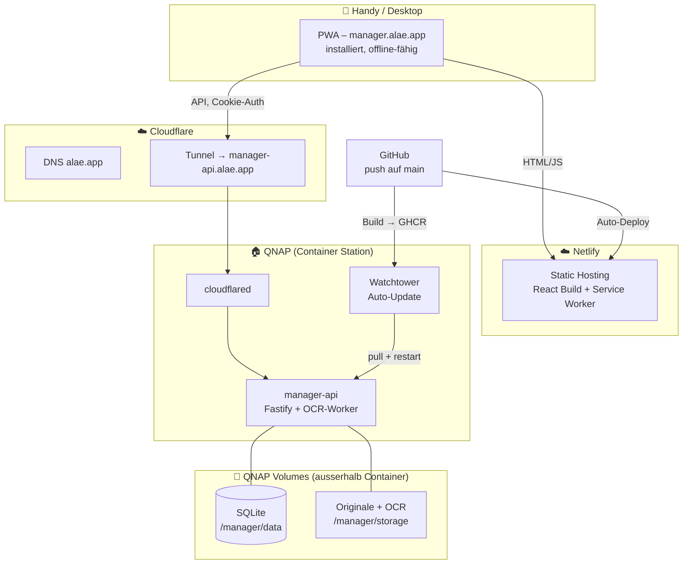
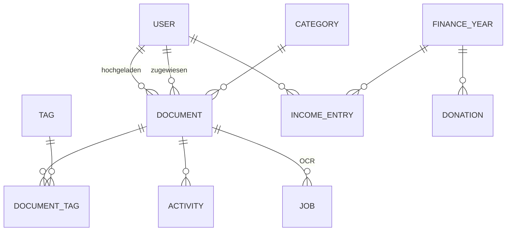
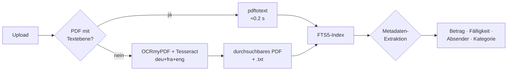
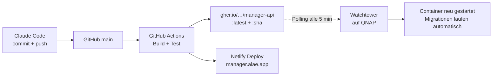

# Manager – Konzept

Haushalts-Administration als PWA. Dokumente, Pendenzen, Einkaufsliste, Notizen und
Finanzen (Zehnten / Fastopfer) für zwei Personen.

Stand: 2026-07-28 · Status: Entwurf zur Freigabe

---

## 1. Ziel und Rahmen

**Problem:** Rechnungen, Post, Verträge und Belege liegen verteilt in Mail-Postfächern,
auf Papier und in Screenshots. Niemand weiss zuverlässig, was noch offen ist.

**Ziel:** Eine App, die auf dem Handy in unter 10 Sekunden ein Dokument aufnimmt,
es durchsuchbar ablegt, klar zeigt wer was wann erledigt hat – und daneben die
täglichen Kleinigkeiten (Einkauf, Notizen) sowie die Zehnten-Abrechnung abdeckt.

**Leitprinzipien:**

1. **Mobile first, Daumen first.** Jede Kernaktion in maximal zwei Taps erreichbar.
2. **Die Daten gehören uns.** Originaldateien liegen als normale Dateien auf dem QNAP,
   in einer lesbaren Ordnerstruktur – auch dann noch nutzbar, wenn die App eines Tages
   nicht mehr läuft.
3. **Der Container ist wegwerfbar.** Alles Wertvolle liegt in gemounteten Volumes,
   nicht im Container. Neu deployen darf nie Daten kosten.
4. **Nichts erzwingen.** OCR, Kategorien und Metadaten sind Vorschläge, keine Pflichtfelder.

**Nicht im ersten Wurf:** Mehrere Haushalte, Rollen/Rechte über "beide sehen alles"
hinaus, Buchhaltung im engeren Sinn, E-Mail-Postfach-Anbindung, Kalender.

---

## 2. Architektur im Überblick



**Kurz:** Frontend statisch auf Netlify, Backend als Container zuhause auf dem QNAP,
verbunden über einen Cloudflare Tunnel. Daten liegen in zwei Bind-Mounts auf dem NAS.
Deployment passiert vollständig über `git push`.

---

## 3. Technologie-Entscheide

| Bereich | Wahl | Begründung |
|---|---|---|
| Frontend | React 19 + TypeScript + Vite | Schnell, riesiges Ökosystem, gute PWA-Tooling-Lage |
| UI | Tailwind CSS + Radix Primitives | Mobile-first ohne Design-System-Ballast, barrierefreie Basiskomponenten |
| PWA | `vite-plugin-pwa` (Workbox) | Manifest, Service Worker, Precaching, Share Target aus einer Hand |
| State/Sync | TanStack Query + IndexedDB (Dexie) | Server-State-Caching und Offline-Queue ohne eigenes Framework |
| Backend | Node 22 + Fastify + TypeScript | Eine Sprache über den ganzen Stack, sehr schneller Upload-Pfad (Streams) |
| Datenbank | SQLite (better-sqlite3, WAL) + Drizzle ORM | Für zwei Nutzer ideal: eine Datei, kein Server, trivial zu sichern |
| Volltextsuche | SQLite FTS5 (Unicode61, deutsche Stoppwörter) | Reicht für zehntausende Dokumente, keine Zusatzdienste |
| OCR | OCRmyPDF + Tesseract (deu, fra, eng) | Erzeugt durchsuchbare PDFs, Standard im Dokumenten-Umfeld |
| PDF-Tools | Poppler (`pdftotext`, `pdftoppm`) | Digital erzeugte PDFs brauchen gar kein OCR |
| Jobs | Job-Tabelle in SQLite + In-Process-Worker | Kein Redis, keine zweite Infrastruktur für ~20 Jobs/Tag |
| Auth | Passwort (argon2id) + HttpOnly-Session-Cookie | Zwei Konten, kein Identity-Provider nötig |

**Warum SQLite und nicht Postgres:** Zwei Nutzer, wenige Schreibzugriffe gleichzeitig.
SQLite bedeutet: ein Container statt zwei, Backup = Dateikopie, kein Verbindungs-Pooling,
keine Passwörter. Wichtig ist nur, dass die DB-Datei auf einem *lokalen* QNAP-Volume liegt
(nicht auf einer NFS/SMB-Freigabe) – das ist mit Container-Station-Bind-Mounts gegeben.
Sollte die App je wachsen, ist der Wechsel dank ORM-Schicht ein überschaubarer Umbau.

---

## 4. Datenablage auf dem QNAP

Zwei getrennte Bind-Mounts, beide ausserhalb des Containers:

```
/share/Container/manager/data/          → DB_DIR   (SQLite + WAL, klein, schnell)
/share/Dokumente/Manager/               → STORAGE_DIR (Originale + Ableitungen, gross)
```

`STORAGE_DIR` darf bewusst auf einer anderen Freigabe oder einem anderen Volume liegen –
dort, wo dein bestehendes Backup (Hybrid Backup Sync / Snapshots) ohnehin schon greift.

**Ordnerstruktur der Ablage – bewusst menschenlesbar:**

```
/share/Dokumente/Manager/
├── 2026/
│   ├── Versicherung/
│   │   ├── 2026-03-14__Krankenkasse-Praemie-Maerz__a3f9.pdf
│   │   └── 2026-03-14__Krankenkasse-Praemie-Maerz__a3f9.txt   ← OCR-Text
│   ├── Steuern/
│   └── Wohnen/
├── 2025/
└── .trash/                              ← 30 Tage Papierkorb, dann echt gelöscht
```

* Dateiname = `Datum__Titel__kurz-ID`. Die 4-stellige ID am Ende macht ihn eindeutig,
  auch wenn zwei Dokumente gleich heissen.
* Die Datenbank kennt nur den **relativen Pfad**. Wird der Storage-Ordner verschoben,
  ändert sich nur eine Umgebungsvariable.
* Bei Änderung von Titel/Kategorie/Datum benennt die App die Datei atomar um und
  schreibt den neuen Pfad in die DB – die Ablage bleibt dauerhaft aufgeräumt.
* Ableitungen (OCR-Text, durchsuchbares PDF, Thumbnail) liegen neben dem Original.
* **Deduplizierung:** SHA-256 jeder Datei wird gespeichert. Beim Upload eines Duplikats
  fragt die App nach, statt still ein zweites Exemplar anzulegen.

---

## 5. Datenmodell



**Kerntabellen**

* `users` – id, name, email, password_hash, avatar_color, created_at
* `documents` – id, title, storage_path, mime, size_bytes, sha256, **uploaded_by**,
  **uploaded_at**, doc_date, category_id, **assigned_to**, **status**, due_date,
  amount_chf, vendor, ocr_status, ocr_text, notes, deleted_at
* `categories` – id, name, icon, sort_order (Start-Set: Versicherung, Steuern, Wohnen,
  Fahrzeug, Gesundheit, Bank/Finanzen, Arbeit, Verträge, Garantie/Quittung, Behörden, Sonstiges)
* `tags`, `document_tags` – freie Verschlagwortung neben den Kategorien
* `documents_fts` – FTS5 über Titel, Absender, OCR-Text, Notizen
* `activity` – wer hat wann was gemacht (upload, status_change, assign, edit, delete).
  Erfüllt direkt die Anforderung "wer hat wann was hochgeladen" und gibt dem
  Dokument-Detail eine kleine Verlaufsspur.
* `jobs` – OCR-Warteschlange: id, document_id, type, state, attempts, error, timestamps
* `shopping_items`, `notes`, `finance_year`, `income_entries`, `donations`, `sessions`

**Dokument-Status:** `offen` → `in_arbeit` → `erledigt` → `archiviert`.
Bewusst nur vier, mit `offen` als Default. Alles was nicht `erledigt`/`archiviert` ist,
erscheint auf dem Dashboard unter "Pendent".

---

## 6. Funktionen im Detail

### 6.1 Dokumente

**Erfassen – vier Wege, alle schnell:**

| Weg | Plattform | Beschreibung |
|---|---|---|
| Teilen-Menü | Android | PDF aus Gmail/Outlook → Teilen → "Manager". Web Share Target. |
| Kurzbefehl | iOS | Teilen → Kurzbefehl "An Manager", lädt direkt via API hoch (siehe 8.2) |
| Kamera-Scan | beide | In-App: Foto → automatischer Randbeschnitt, Entzerrung, Kontrast → PDF |
| Datei/Screenshot | beide | Normaler Datei-Picker, Mehrfachauswahl möglich |

Nach dem Upload landet das Dokument sofort in der Liste – der Nutzer wartet **nie** auf OCR.
Die Verarbeitung läuft im Hintergrund, der Status wird live nachgeführt.

**Erfassungs-Dialog** (erscheint direkt nach dem Upload, alles vorausgefüllt und optional):
Titel · Kategorie · Datum · Zuständig (ich / Ehefrau / beide) · Status · Fällig am · Betrag.
Ein Tap auf "Fertig" genügt, alles andere lässt sich später ergänzen.

**Suchen:** Ein Suchfeld über allem. Sucht gleichzeitig in Titel, Absender, Notizen und
OCR-Volltext, mit Treffer-Hervorhebung im Textausschnitt. Dazu Filterchips für Kategorie,
Person, Status, Jahr und Betragsbereich.

**Ansichten:** Dashboard (Pendenzen, Fälligkeiten, letzte Uploads) · Liste/Suche ·
Dokument-Detail (Vorschau, Metadaten, Verlauf, Teilen, Download).

### 6.2 Einkaufsliste

Eine gemeinsame Liste, offline-fähig. Neuer Eintrag über ein einzeiliges Feld am unteren
Rand (immer erreichbar). Tap = erledigt, wandert nach unten und wird ausgegraut.
Automatische Sortierung nach Ladenkategorie (Früchte, Molkerei, …) auf Basis der
zuletzt verwendeten Zuordnung. "Erledigte löschen" räumt auf. Änderungen der einen Person
erscheinen bei der anderen live (Polling im Vordergrund, Push optional).

### 6.3 Notizen

Kurze Notizen mit Titel und Markdown-Text, optional als Checkliste. Anheften, Farbe,
Volltextsuche. Bewusst schlicht – kein zweites Notion.

### 6.4 Finanzen: Zehnten und Fastopfer

Das Herzstück neben den Dokumenten.

**Erfassung pro Monat** (ein Bildschirm, zwei Zahlen):

```
Juli 2026
  Einkommen Alain      CHF  ________
  Einkommen [Ehefrau]  CHF  ________
  + weitere Einnahme hinzufügen
```

**Jahres-Einstellungen:** Steuerbetrag für das Jahr (CHF), Verteilmodus
(gleichmässig auf 12 Monate *oder* nach tatsächlichen Zahlungsterminen),
Zehnten-Satz (Standard 10 %) und Berechnungsbasis.

**Berechnungsbasis – konfigurierbar,** weil das eine persönliche Entscheidung ist:

* `brutto` – 10 % vom gesamten Einkommen
* `brutto_minus_steuern` – **Standard gemäss deinem Wunsch:** Steuern werden vom
  Einkommen abgezogen, der Zehnte auf den Rest berechnet
* `netto` – 10 % vom ausbezahlten Betrag

Rechenbeispiel im Standardmodus, Steuern 12 000 CHF/Jahr, gleichmässig verteilt:

```
Einkommen Juli (beide)      CHF 9 000.00
− Steueranteil Juli          CHF 1 000.00   (12 000 / 12)
= Zehnten-Basis Juli        CHF 8 000.00
→ Zehnter (10 %)            CHF   800.00
```

**Abrechnungsstand:** In `donations` werden geleistete Zahlungen erfasst
(Datum, Betrag, Art: Zehnten / Fastopfer / andere Spende, "abgerechnet bis Monat").
Das Dashboard zeigt daraus dauerhaft:

> **Zehnten abgerechnet bis:** Mai 2026 · **Offen:** CHF 1 640.00 (Juni, Juli)

**Fastopfer** wird separat geführt – freier Monatsbetrag, keine Berechnung, nur Erfassung
und Jahressumme.

**Jahresübersicht:** Tabelle Monat × (Einkommen A, Einkommen B, Steuern, Basis, Zehnter,
bezahlt, Differenz) mit Jahressummen. Export als PDF und CSV – praktisch für das
Jahresgespräch im Dezember.

---

## 7. OCR-Pipeline



* **Schritt 1 – gratis abkürzen:** Digital erzeugte PDFs (die Mehrheit aus E-Mails) haben
  bereits eine Textebene. `pdftotext` liefert sie in Millisekunden, ohne OCR.
* **Schritt 2 – OCR nur wenn nötig:** Fotos und gescannte PDFs laufen durch OCRmyPDF.
  Ergebnis: das Original bleibt unangetastet, daneben entsteht ein durchsuchbares PDF
  und eine `.txt`-Datei. Rechenzeit auf dem QNAP: grob 3–10 s pro Seite.
* **Schritt 3 – Metadaten:** Zuerst Regex/Heuristik auf Schweizer Muster
  (Beträge `1'234.55`, Datumsformate, IBAN, "zahlbar bis"). Optional und zuschaltbar:
  Claude API für strukturierte Extraktion und Kategorie-Vorschlag, wenn die Heuristik
  unsicher ist. Das bleibt eine austauschbare Komponente – die App funktioniert
  vollständig ohne.
* **Später (Etappe 6): Schweizer QR-Rechnung.** Der QR-Code auf praktisch jeder Rechnung
  enthält Betrag, Empfänger und Referenz strukturiert und fehlerfrei. Auslesen ist
  deutlich verlässlicher als jedes OCR – für unseren Alltag der grösste Einzelgewinn.

Fehlgeschlagene Jobs werden dreimal mit wachsendem Abstand wiederholt und danach im
Dokument sichtbar markiert ("Texterkennung fehlgeschlagen – erneut versuchen").

---

## 8. PWA und Mobile

### 8.1 Installation und Verhalten

Manifest mit `display: standalone`, Icons bis 512 px, Maskable-Icon, Theme-Color,
`orientation: portrait`. Auf Android über den Installations-Prompt, auf iOS über
"Zum Home-Bildschirm". Ab iOS 26 öffnen Home-Screen-Sites standardmässig als Web-App.

**Offline:** App-Shell und letzte Dokumentenliste werden vorgehalten. Einkaufsliste und
Notizen sind vollständig offline nutzbar (lokale Änderungen in IndexedDB, Sync-Queue bei
Verbindung). Uploads ohne Netz werden vorgemerkt und automatisch nachgeholt.

### 8.2 Das Teilen-Thema – ehrlich betrachtet

Dies ist der einzige Punkt, an dem die Plattformen auseinanderlaufen:

* **Android:** Web Share Target funktioniert. `share_target` im Manifest mit
  `method: POST`, `enctype: multipart/form-data`. Der Service Worker fängt den Request ab,
  legt die Datei in der Cache Storage ab und leitet in die Erfassungsmaske um. Damit ist
  "PDF aus Mail → Teilen → Manager" genau so schnell wie gewünscht.
* **iOS/iPadOS:** Safari unterstützt Web Share Target **nicht** – auch 2026 nicht.
  Eine installierte PWA erscheint dort nicht im Teilen-Menü. Das lässt sich nicht
  umgehen, aber gleichwertig lösen:
  **Apple-Kurzbefehl "An Manager"**. Ein Kurzbefehl, der Dateien entgegennimmt und per
  `POST` an `manager-api.alae.app/api/share` sendet (mit einem langlebigen Gerätetoken aus der App).
  Er erscheint direkt im iOS-Teilen-Menü, exakt neben den nativen Apps. Ich liefere den
  Kurzbefehl fertig konfiguriert mit – Einrichtung einmalig, etwa zwei Minuten.

**Deshalb ist die Frage nach eurer Handy-Plattform die wichtigste offene Entscheidung** –
sie bestimmt, welcher der beiden Wege in Etappe 2 gebaut wird (oder beide).

---

## 9. Sicherheit und Zugang

* **Konten:** Zwei, manuell angelegt, keine offene Registrierung.
* **Passwörter:** argon2id. Session als HttpOnly-, Secure-, SameSite=Lax-Cookie auf
  `.alae.app`. Da `manager.alae.app` und `manager-api.alae.app` dieselbe Registrable Domain
  teilen, gilt das als same-site – kein `SameSite=None` nötig, keine Third-Party-Cookie-Probleme.
* **Sitzungsdauer:** 90 Tage mit rollierender Erneuerung. Auf dem Handy soll man sich
  nicht ständig neu anmelden. Optional später: Face-ID/Touch-ID via Passkey (WebAuthn).
* **CORS:** Strikt auf `https://manager.alae.app` beschränkt, `credentials: true`.
* **Rate Limiting** auf Login und Upload-Endpunkten.
* **Keine Ports offen.** Der Cloudflare Tunnel baut die Verbindung von innen nach aussen
  auf; die QNAP-Firewall braucht keine eingehende Regel. Zusätzlich: Cloudflare WAF-Regel,
  die alles ausser den erwarteten API-Pfaden verwirft.
* **Dateizugriff:** Dokumente werden nie direkt vom Webserver ausgeliefert, sondern nur
  über authentifizierte Endpunkte mit kurzlebigen, signierten Download-Links.
* **Backup:** Nächtlich `sqlite3 .backup` in den Storage-Ordner, damit dein bestehendes
  QNAP-Backup eine garantiert konsistente Kopie mitnimmt. Zusätzlich 30-Tage-Papierkorb
  statt echtem Löschen.

---

## 10. Deployment – "Claude Code aktualisiert den Container"



**Backend:** Push auf `main` → GitHub Actions baut ein Multi-Arch-Image (amd64 + arm64)
und pusht es nach GHCR. Watchtower auf dem QNAP prüft alle fünf Minuten, zieht die neue
Version und startet den Container neu – nur Container mit passendem Label, damit deine
anderen Dienste unberührt bleiben. Datenbank-Migrationen laufen beim Start automatisch.
Kein eingehender Zugriff auf das NAS nötig, kein manueller Schritt.

**Frontend:** Netlify baut bei jedem Push automatisch und veröffentlicht auf
`manager.alae.app`.

**Ergebnis:** Ich sage "das ist umgesetzt", und fünf Minuten später läuft es bei dir –
ohne dass du dich am QNAP anmelden musst.

**docker-compose.yml auf dem QNAP** (einmalig einrichten, danach unverändert):

```yaml
services:
  manager-api:
    image: ghcr.io/vonallmenalain/manager-api:latest
    container_name: manager-api
    restart: unless-stopped
    environment:
      - NODE_ENV=production
      - DB_DIR=/data
      - STORAGE_DIR=/storage
      - APP_ORIGIN=https://manager.alae.app
      - SESSION_SECRET=${SESSION_SECRET}
      - OCR_LANGUAGES=deu+fra+eng
    volumes:
      - /share/Container/manager/data:/data
      - /share/Dokumente/Manager:/storage
    labels:
      - com.centurylinklabs.watchtower.enable=true

  cloudflared:
    image: cloudflare/cloudflared:latest
    restart: unless-stopped
    command: tunnel run
    environment:
      - TUNNEL_TOKEN=${TUNNEL_TOKEN}

  watchtower:
    image: containrrr/watchtower
    restart: unless-stopped
    command: --interval 300 --label-enable --cleanup
    volumes:
      - /var/run/docker.sock:/var/run/docker.sock
```

Falls dein Auto-Update bei der Share-App anders funktioniert (Portainer-Webhook,
eigenes Skript, …), übernehmen wir stattdessen genau dieses Muster – bewährt schlägt neu.

---

## 11. Projektstruktur

```
manager/
├── apps/
│   ├── web/          React-PWA  → Netlify
│   └── api/          Fastify + OCR-Worker → Container
├── packages/
│   └── shared/       Typen, Zod-Schemas, Berechnungslogik (von beiden genutzt)
├── infra/
│   ├── docker-compose.yml
│   └── Dockerfile
├── docs/
│   ├── KONZEPT.md
│   └── SETUP-QNAP.md
└── .github/workflows/
```

Ein Monorepo mit npm-Workspaces. Der entscheidende Gewinn: `packages/shared` enthält die
API-Verträge und die Zehnten-Berechnung genau einmal – Frontend und Backend können nicht
auseinanderlaufen, und die Rechenlogik ist an einem Ort testbar.

---

## 12. Roadmap

Jede Etappe ist eigenständig deploybar und sofort nutzbar. Nach Etappe 1 hast du bereits
eine funktionierende App auf dem Handy.

| # | Etappe | Inhalt | Ergebnis für dich |
|---|---|---|---|
| **0** ✅ | **Fundament** | Monorepo, CI/CD, Container, Tunnel, Domain, Login | `manager.alae.app` ist erreichbar, ihr könnt euch anmelden |
| **1** ✅ | **Dokumente** | Upload, Liste, Detail, Kategorien, Status, Zuweisung, Metadatensuche, Aktivitätsverlauf | Erste echte Dokumente sind abgelegt und auffindbar |
| **2** | **Mobil** | PWA-Installation, Share Target (Android) bzw. Kurzbefehl (iOS), Kamera-Scan, Offline-Shell | Der 10-Sekunden-Weg vom Mail zum abgelegten Dokument |
| **3** | **OCR** | Job-Worker, OCRmyPDF, Volltextindex, Suche mit Textausschnitten, Metadaten-Heuristik | Suche findet Inhalte, nicht nur Titel |
| **4** | **Alltag** | Einkaufsliste, Notizen, beides offline-fähig mit Sync | Die App wird täglich benutzt, nicht nur bei Post |
| **5** | **Finanzen** | Monatserfassung, Steuerabzug, Zehnten-Berechnung, Abrechnungsstand, Fastopfer, Jahresexport | Die Zehnten-Abrechnung ist erledigt statt geschätzt |
| **6** | **Feinschliff** | Push-Erinnerungen für Fälligkeiten, Schweizer QR-Rechnung, Backup-Automatik, Papierkorb | Die App denkt mit |

Reihenfolge ist verschiebbar. Wenn die Zehnten-Abrechnung dringender ist als OCR,
ziehen wir Etappe 5 vor – sie hängt von nichts ab ausser Etappe 0.

---

## 13. Getroffene Entscheidungen

| Frage | Entscheid | Folge |
|---|---|---|
| Handy-Plattform | **Beide Android** | Web Share Target wird nativ gebaut, kein iOS-Kurzbefehl nötig |
| DNS `alae.app` | **Cloudflare** | Cloudflare Tunnel für `manager-api.alae.app`, keine offenen Ports |
| Container-Updates | **Watchtower** | Wie im Konzept beschrieben, identisch zur Share-App |
| Reihenfolge | **Etappe 0 → 1 → 2** | Fundament, Dokumente, dann der schnelle Handy-Upload |

## 14. Noch offen

| # | Frage | Wann relevant |
|---|---|---|
| 1 | Speicherort der Ablage auf dem QNAP (welche Freigabe?) | Beim Einrichten des Containers – bis dahin gelten die Standardpfade |
| 2 | Claude API für Metadaten-Extraktion gewünscht? | Etappe 3; ohne funktioniert alles, mit wird das Ausfüllen komfortabler |
| 3 | Vorname deiner Frau für ihr Konto | Beim Anlegen der Konten in Etappe 0 |

Das Image wird für **amd64 und arm64** gebaut – damit ist das QNAP-Modell irrelevant.
